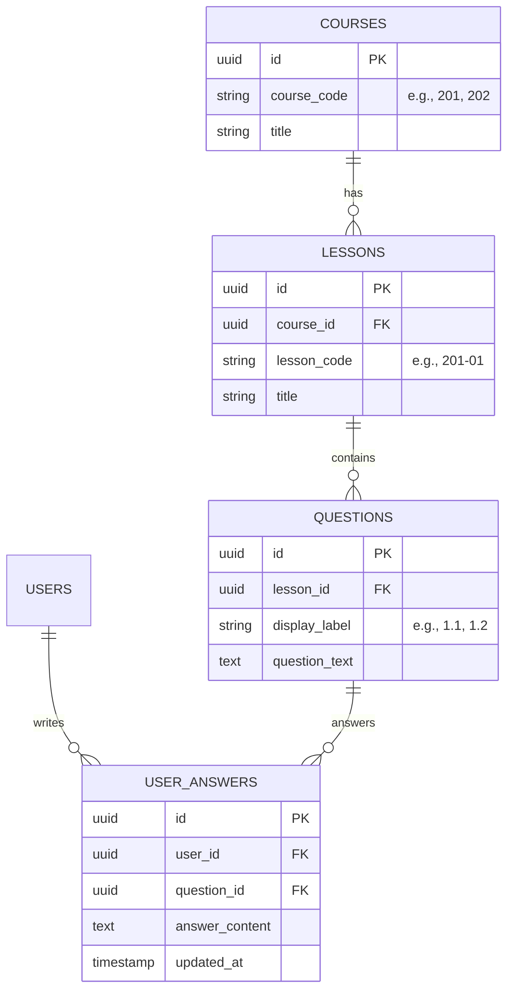

# Discipleship Database & Supabase Integration Plan

**Purpose:** This document outlines the roadmap for migrating the Growing Together discipleship curriculum from a static, file-based prototype to a dynamic, user-enabled web application. It defines the database schema, details the authentication flows, and establishes the timeline for when to connect and test the database.

---

## 📅 When is the Right Time to Test the Database?

**Recommendation:** Begin connecting and testing the database setup **immediately after the core curriculum content is 100% written, but before building advanced user dashboard interfaces.**

Since you are currently **2/3 done** (with some stubs remaining in Course 202 and 203), keeping the database disconnected on purpose is the correct strategy. Here is why you should wait until the content is complete:

1.  **Schema Stability:** If you connect the database now, any changes to lesson structures, interactive widgets, or question types will force you to run migrations and rewrite database schemas. Writing the remaining stubs first ensures you have a finalized inventory of all questions and asset dependencies.
2.  **Avoid "Double Debugging":** Keeping the frontend decoupled from the database allows you to isolate bugs. If a widget breaks right now, you know it is a rendering or scripting issue. Once the database is connected, debugging becomes twice as complex because you must trace whether the issue is on the client, the network, the API middleware, or the database.
3.  **The Pivot Point:** Completing the curriculum marks the end of the "content phase." Once the content is locked, you and your AI assistants can pivot 100% to the "application phase" (user auth, saving answers, offline sync, and progress tracking).

---

## 🗺️ Supabase Database Architecture

To prevent question number collisions (e.g., Question `1.1` in Lesson `201-01` vs. Question `1.1` in Lesson `202-01`), the database uses a hierarchical relational structure using **UUIDs** (universally unique identifiers) for references rather than raw display labels.

### Entity-Relationship Diagram

### Table Definitions

*   `courses`: Holds the high-level course meta (e.g., 100, 200, 300 level).
*   `lessons`: Links to `courses`. Tracks the lesson codes (e.g., `201-01`, `202-01`).
*   `questions`: Holds individual questions. Because each question has a unique, system-generated UUID and is linked to a specific `lesson_id`, Question `1.1` in `201-01` and Question `1.1` in `202-01` are treated as separate rows and will never collide.
*   `user_answers`: Maps a user's ID (supplied by Supabase Auth) to the question's UUID, storing their text answers and progress.

---

## 🔐 Authentication Specifications

Supabase handles these requirements natively, requiring minimal custom code:

1.  **Google Sign-In:** Configured in the Supabase Dashboard under *Authentication > Providers*. Requires setting up a Client ID and Secret in Google Cloud Console.
2.  **Email & Password:** Native email sign-in flow.
3.  **Forgot Password Flow:**
    *   The frontend triggers: `supabase.auth.resetPasswordForEmail(email, { redirectTo: '...' })`.
    *   Supabase sends a secure reset link to the user's email.
    *   The user is redirected back to your reset page to set a new password.

---

## 🤖 AI Orchestration Rules (For Claude / Gemini / Codex)

When you are ready to build the integration, instruct your AI assistant to:

0.  **Audit Question IDs:** Start by prompting: *"Check the question IDs and make sure they are ready for the database."* The AI will scan all JSON files in the `data/` folder to ensure all interactive inputs have unique, stable IDs and update them if necessary.
1.  **Review the Schema:** Point the AI to this `DATABASE-PLAN.md` file so it understands the table relations.
2.  **Generate Types:** Run `npx supabase gen types typescript` to generate the TypeScript definitions file and provide it to the AI.
3.  **Implement Local Storage Fallback first:** Build a service layer that saves answers to `localStorage` when the user is anonymous, and syncs them to Supabase once the user signs in.

